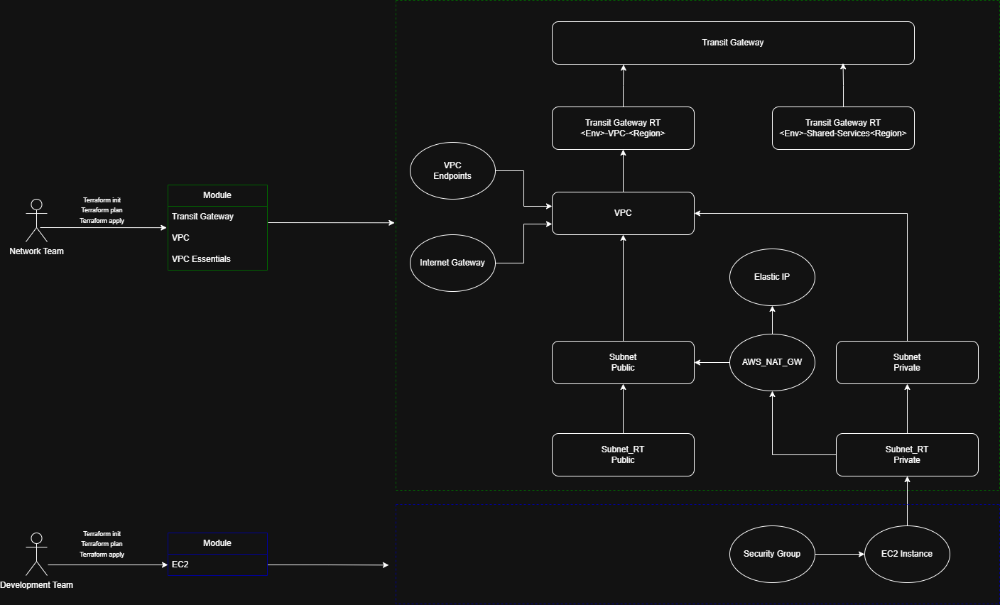

# Terraform AWS Network Platform

This repository demonstrates an enterprise-style infrastructure platform built with Terraform for deploying modular AWS networking environments. The design models a real-world organizational pattern where a centralized platform/network engineering team manages shared infrastructure while application teams deploy workloads using standardized modules. 

It models a common enterprise deployment pattern where shared network infrastructure is managed by a **network/platform team**, while application teams deploy workloads using standardized modules.

---

## Table of Contents
1. [Project Goals](#project-goals)
2. [Enterprise Deployment Scenario](#enterprise-deployment-scenario)
3. [Benefits](#benefits)
4. [Architecture Overview](#architecture-overview)
5. [Repository Structure](#repository-structure)
6. [Modules](#modules)
7. [Terraform State Management](#terraform-state-management)
8. [Usage Examples](#usage-examples)
    - [Example 1: Network Team Deploying Transit Gateway](#example-1-network-team-deploying-transit-gateway)
    - [Example 2: Network Team Deploying VPC](#example-2-network-team-deploying-vpc)
    - [Example 3: Network Team Deploying VPC Essentials](#example-3-network-team-deploying-vpc-essentials)
    - [Example 4: Development Team Deploying EC2](#example-4-development-team-deploying-ec2)
9. [Skills Demonstrated](#skills-demonstrated)
10. [Future Enhancements](#future-enhancements)

---

## Project Goals

This project showcases IaC best practices, including:

- Reusable Terraform modules  
- Environment separation  
- Team-based infrastructure ownership  

---

## Enterprise Deployment Scenario

In many organizations:

- A **platform/network engineering team** deploys and maintains shared infrastructure:  
  - VPC architectures  
  - Transit Gateways  
  - Networking services  
  - Security baselines  

- **Application teams** deploy workloads using standardized modules without modifying core network infrastructure.  

---

## Benefits

This modular approach provides:

- Improved governance  
- Faster application deployments  
- Consistent infrastructure  
- Scalable onboarding of new teams  

---

## Architecture Overview

This project demonstrates a modular Terraform-based AWS networking platform designed to separate responsibilities between platform infrastructure and application workloads.

The **Network Team** provisions and manages the shared networking infrastructure using reusable Terraform modules, including the Transit Gateway, VPC, and supporting networking components. 

The **Development Team** consumes the platform by deploying workloads (such as EC2 instances) into the provided networking environment without needing to manage the underlying network infrastructure.

<p align="center">
  
</p>

### Key Components

- **Transit Gateway** – Provides centralized connectivity between VPCs and shared services
- **VPC** – Serves as the core network boundary for application environments
- **Public Subnets** – Host infrastructure components that require internet access
- **Private Subnets** – Isolated environment for application workloads
- **Internet Gateway** – Enables internet connectivity for public subnet resources
- **NAT Gateway** – Allows private subnet resources to access the internet securely
- **Route Tables** – Control network routing between subnets and gateways
- **VPC Endpoints** – Provide private connectivity to AWS services
- **Security Groups** – Control inbound and outbound traffic for compute resources
- **EC2 Instances** – Example workloads deployed by application teams

---

## Repository Structure

The repository is organized into the following directory layout:

- **terraform-aws-network-platform/**
  - **modules/**
    - **vpc/**
      - main.tf
      - variables.tf
      - outputs.tf
    - **VPC-Essentials/**
      - main.tf
      - locals.tf
      - variables.tf
    - **Transit-Gateway/**
      - main.tf
      - variables.tf
    - **ec2/**
      - main.tf
      - locals.tf
      - variables.tf
      - outputs.tf
  - **README.md**

## Modules

Modules are **separated to control resource creation and prevent excessive AWS API calls**.  

**Included Modules:**

- Transit Gateway Module  
- VPC Module  
- VPC Essentials Module  
- EC2 Module  

---

## Terraform State Management

To avoid conflicts, use **separate backend paths** for each team, environment, account, and module.

**Example backend configuration:**

```hcl
terraform {
  backend "s3" {
    bucket = "example"
    key    = "network-core/region/dev/vpcs/account-id/team-name/terraform.tfstate"
    region = "region"
  }
}
```

---

## Usage Examples

### Example 1: Network Team Deploying Transit Gateway

**provider.tf**

```hcl
terraform {
  required_providers {
    aws = {
      source  = "hashicorp/aws"
      version = "~> 6.0"
    }
  }
}
```

**main.tf**

```hcl
module "tgw_onboarding" {
  source = "git::https://github.com/knippcolin2-17/terraform-aws-network-platform.git//modules/Transit-Gateway?ref=main"

  current_environment = var.environment
  BGP_ASN_AVAIL       = var.BGP_ASN_AVAIL
}
```

**variables.tf**

```hcl
variable "environment" {
  type        = string
  description = "Current environment"
}

variable "BGP_ASN_AVAIL" {
  type = map(number)
}
```

**terraform.tfvars**

```hcl
environment = "DEV"

BGP_ASN_AVAIL = {
  us-east-1 = 65413
  us-east-2 = 65414
  us-west-1 = 65415
  us-west-2 = 65416
}
```

---

### Example 2: Network Team Deploying VPC

**main.tf**

```hcl
module "vpc_onboarding" {
  source = "git::https://github.com/knippcolin2-17/terraform-aws-network-platform.git//modules/vpc?ref=main"

  team_owner          = var.team_name
  current_environment = var.environment
  new_vpc_cidr_block  = var.cidr_block
}
```

**variables.tf**

```hcl
variable "environment" {
  type        = string
  description = "Current environment"
}

variable "team_name" {
  type        = string
  description = "Name of the team requesting the VPC"
}

variable "cidr_block" {
  type = map(string)
}
```

**terraform.tfvars**

```hcl
team_name = "Team-B"
environment = "DEV"

cidr_block = {
  us-east-1 = "10.1.0.0/16"
  us-east-2 = "10.0.0.0/16"
  us-west-1 = "10.2.0.0/16"
  us-west-2 = "10.3.0.0/16"
}
```

---

### Example 3: Network Team Deploying VPC Essentials

**provider.tf**

```hcl
terraform {
  required_providers {
    aws = {
      source  = "hashicorp/aws"
      version = "~> 6.0"
    }
  }
}
```

**main.tf**

```hcl
module "vpc_essentials" {
  source = "git::https://github.com/knippcolin2-17/terraform-aws-network-platform.git//modules/vpc-essentials?ref=main"

  team_owner          = var.team_name
  current_environment = var.environment
}
```

**variables.tf**

```hcl
variable "environment" {
  type = string
  description = "Current environment"
}

variable "team_name" {
  type = string
  description = "Name of the team requesting the VPC deployment"
}
```

**terraform.tfvars**

```hcl
team_name = "Team-B" #replace this with appropriate Team name

environment = "DEV" #replace with appropriate environment eg. DEV or Prod
```

---

### Example 4: Development Team Deploying EC2

**provider.tf**

```hcl
terraform {
  required_providers {
    aws = {
      source  = "hashicorp/aws"
      version = "~> 6.0"
    }
  }
}
```

**main.tf**

```hcl
module "ec2_onboarding" {
  source = "git::https://github.com/knippcolin2-17/terraform-aws-network-platform.git//modules/ec2?ref=main"

  team_owner          = var.team_name
  current_environment = var.environment
  application_name    = var.app_name

  operating_system = "amazon_linux"
  instance_size    = "small"
  instance_count   = 2
}
```

**variables.tf**

```hcl
variable "team_name" {
    type = string
    description = "team deploying the configuration"
}

variable "environment" {
  type = string
  description = "Current environment"
}

variable "app_name" {
  type = string
  description = "Name for the application being hosted on the EC2"
}
```

**terraform.tfvars**

```hcl
team_name = "Team-A" #replace this with appropriate Team name

environment = "DEV" #replace with appropriate environment eg. DEV or Prod

app_name = "Artifactory" #replace with appropriate application name
```

---

## Skills Demonstrated

- Terraform module design
- AWS network architecture
- Transit Gateway connectivity patterns
- VPC segmentation and design
- Infrastructure as Code best practices
- Multi-team iplatform architecture
- Terraform state management strategies
- Modular infrastructure platform design

---

## Future Enhancements

- CI/CD pipelines for Terraform
- Centralized logging
- Security monitoring
- Multi-account AWS organization deployments
